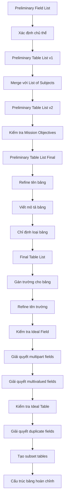

# 📚 CHƯƠNG 7: ESTABLISHING TABLE STRUCTURES
## Xây Dựng Cấu Trúc Bảng

> *"It is a capital mistake to theorize before one has data."* - Sherlock Holmes

---

## 📋 MỤC LỤC

1. [Tổng Quan Chương 7](#tổng-quan)
2. [Tầm Quan Trọng của Bảng](#tầm-quan-trọng)
3. [Xây Dựng Preliminary Table List](#preliminary-table-list)
4. [Xây Dựng Final Table List](#final-table-list)
5. [Gán Trường cho Bảng](#gán-trường)
6. [Tinh Chỉnh Trường (Refining Fields)](#tinh-chỉnh-trường)
7. [Tinh Chỉnh Cấu Trúc Bảng](#tinh-chỉnh-bảng)
8. [Các Quy Tắc & Nguyên Tắc](#quy-tắc)
9. [Checklist](#checklist)

---

## 🎯 TỔNG QUAN {#tổng-quan}

### Mục Đích Chương
Chương 7 hướng dẫn cách xác định và thiết lập **cấu trúc bảng** (table structures) - nền tảng của cơ sở dữ liệu quan hệ.

### Các Bước Chính
1. Định nghĩa **Preliminary Table List** (Danh sách Bảng Sơ bộ)
2. Tạo **Final Table List** (Danh sách Bảng Cuối cùng)
3. Gán các trường (fields) cho từng bảng
4. Tinh chỉnh các trường
5. Tinh chỉnh cấu trúc bảng

---

## 🏗️ TẦM QUAN TRỌNG CỦA BẢNG {#tầm-quan-trọng}

### Bảng Là Gì?
- **Bảng** đại diện cho một **chủ thể** (subject) mà tổ chức cần theo dõi
- Mỗi bảng được cấu thành từ các **trường** (fields) - đại diện cho đặc điểm của chủ thể

### Vai Trò
- 🏛️ Bảng là **nền móng** của cơ sở dữ liệu
- ✅ Bảng được thiết kế đúng → Nền tảng vững chắc
- ❌ Bảng được thiết kế sai → Cấu trúc yếu, dữ liệu không chính xác

### Ví Dụ Thực Tế
| Loại Tổ Chức | Bảng Cần Thiết |
|---------------|----------------|
| **Phòng khám y tế** | Patients, Doctors, Appointments |
| **Công ty cho thuê thiết bị** | Customers, Equipment, Rental Agreements |
| **Văn phòng đăng ký** | Students, Teaching Staff, Courses |

---

## 📝 XÂY DỰNG PRELIMINARY TABLE LIST {#preliminary-table-list}

### Ba Nguồn Xác Định Bảng

#### 1️⃣ Từ Preliminary Field List
**Phương pháp:**
- Xem xét các nhóm trường trong Preliminary Field List
- Hỏi: "Tập hợp trường này định nghĩa/mô tả chủ thể nào?"
- Thêm các chủ thể đã xác định vào Preliminary Table List

**Ví dụ:**
```
Preliminary Field List:
- Student First Name
- Student Last Name  
- Home Phone
- Address
- City
- State

→ Gợi ý chủ thể: STUDENTS
```

**Lợi ích:**
- ✅ Góc nhìn khách quan, không bị ảnh hưởng bởi phỏng vấn
- ✅ Giúp phát hiện các chủ thể bị bỏ sót
- ✅ Kiểm chứng lại công việc trước đó

#### 2️⃣ Từ List of Subjects
**Quy trình 3 bước:**

**Bước 1: Giải quyết các mục trùng lặp**
- So sánh List of Subjects với Preliminary Table List
- Kiểm tra xem các mục trùng tên có đại diện cho cùng chủ thể không?
  - ✅ **Cùng chủ thể** → Giữ một mục
  - ❌ **Khác chủ thể** → Đổi tên để phân biệt, giữ cả hai

**Bước 2: Giải quyết các mục khác tên nhưng cùng chủ thể**
- Xác định các mục có tên khác nhưng đại diện cho cùng chủ thể
- Chọn tên phù hợp nhất
- Loại bỏ các tên khác

**Bước 3: Kết hợp danh sách**
- Thêm các mục còn lại từ List of Subjects vào Preliminary Table List
- Tạo phiên bản thứ 2 của Preliminary Table List

#### 3️⃣ Từ Mission Objectives
**Mục đích:**
- Kiểm tra chéo (cross-check) để đảm bảo không bỏ sót bảng quan trọng
- Xác định các chủ thể được nhắc đến trong Mission Objectives

**Quy trình:**
- Đọc từng Mission Objective
- Xác định các chủ thể được đề cập
- Thêm các chủ thể chưa có vào Preliminary Table List
- Tạo phiên bản cuối cùng của Preliminary Table List

---

## 🎨 XÂY DỰNG FINAL TABLE LIST {#final-table-list}

### Ba Nhiệm Vụ Chính

#### 1. Tinh Chỉnh Tên Bảng (Refining Table Names)

**Quy Tắc Đặt Tên Bảng:**

| Quy Tắc | Mô Tả | Ví Dụ |
|---------|-------|-------|
| **Duy nhất** | Mỗi tên bảng phải khác biệt | ✅ STUDENTS, COURSES<br>❌ DATA, INFO |
| **Mô tả rõ ràng** | Tên phải thể hiện chủ thể đại diện | ✅ EMPLOYEES<br>❌ PEOPLE |
| **Hợp lý** | Dễ hiểu với mọi người trong tổ chức | ✅ CUSTOMERS<br>❌ CUST_TBL_01 |
| **Số nhiều** | Sử dụng danh từ số nhiều | ✅ PRODUCTS<br>❌ PRODUCT |
| **Tránh từ viết tắt** | Trừ khi rõ ràng và được chấp nhận | ✅ INSTRUCTORS<br>⚠️ INST (nếu mọi người hiểu) |
| **Không khoảng trắng** | Dùng underscore hoặc camelCase | ✅ STUDENT_COURSES<br>✅ StudentCourses<br>❌ STUDENT COURSES |
| **Từ riêng biệt** | Mỗi từ có ý nghĩa riêng | ✅ STUDENT_INSTRUCTORS<br>❌ STUDENTSANDINSTRUCTORS |
| **Dùng tên tổ chức** | Có thể thêm tên công ty nếu cần | ✅ XYZ_EMPLOYEES<br>(khi cần phân biệt) |

#### 2. Chỉ Định Loại Bảng (Table Types)

**Bốn Loại Bảng:**

| Loại | Mô Tả | Giai Đoạn Xuất Hiện |
|------|-------|---------------------|
| **Data Table** | Lưu trữ dữ liệu về chủ thể cụ thể | Chương 7 (hiện tại) |
| **Linking Table** | Kết nối hai bảng trong quan hệ many-to-many | Chương 10 (Table Relationships) |
| **Subset Table** | Đại diện chủ thể phụ của data table | Chương 7 (phần sau) |
| **Validation Table** | Lưu giá trị hợp lệ cho một trường | Chương 11 (Business Rules) |

**Lưu ý:** Ở giai đoạn này, tất cả bảng đều là **Data Tables**.

#### 3. Viết Mô Tả Bảng (Table Descriptions)

**Quy Tắc Viết Mô Tả:**

✅ **Nên:**
- Định nghĩa rõ ràng chủ thể mà bảng đại diện
- Giải thích tầm quan trọng của bảng với tổ chức
- Sử dụng câu hoàn chỉnh (không chỉ cụm từ)
- Dễ hiểu với mọi người
- Ngắn gọn nhưng đầy đủ (1-3 câu)

❌ **Không nên:**
- Mô tả mơ hồ, chung chung
- Chỉ liệt kê trường trong bảng
- Sử dụng thuật ngữ kỹ thuật phức tạp

**Ví Dụ Mô Tả Tốt:**
```
STUDENTS - Những cá nhân tham gia các lớp học của chúng tôi. 
Thông tin từ bảng Students cho phép tổ chức quảng bá các khóa học 
và hỗ trợ giao tiếp hiệu quả với học viên.
```

**Quy Trình Tạo Mô Tả:**
1. Phỏng vấn users và management
2. Hỏi: "Bạn mô tả [chủ thể] như thế nào?"
3. Hỏi: "Tại sao thông tin này quan trọng với tổ chức?"
4. Tổng hợp câu trả lời thành mô tả ngắn gọn
5. Xác nhận lại với stakeholders

### Final Table List Hoàn Chỉnh

**Cấu trúc:**
```
Final Table List
-----------------
Tên Bảng: EMPLOYEES
Loại: Data
Mô tả: Những người làm việc cho công ty ở nhiều vị trí khác nhau. 
Thông tin này quan trọng cho mục đích thuế, phúc lợi sức khỏe và 
các vấn đề liên quan đến công việc.
```

---

## 🔗 GÁN TRƯỜNG CHO BẢNG {#gán-trường}

### Quy Trình Gán Trường

**Bước 1: Chuẩn bị**
- Lấy giấy ngang (landscape)
- Viết tên các bảng trên đầu trang
- Để khoảng trống đủ giữa các tên bảng

**Bước 2: Gán trường**
- Từ Preliminary Field List, chọn các trường phù hợp
- Liệt kê dưới tên bảng tương ứng
- Hỏi: "Trường này mô tả đặc điểm nào của chủ thể bảng?"

**Ví dụ:**
```
Table Structures
----------------
SUBJECTS                 CLASSES
Subject Name            Class Number
Subject Description     Class Name
Category                Room Number
Credits                 Instructor Name
                        Subject Name
```

### Nguyên Tắc Gán
- ✅ Gán trường đại diện đặc điểm của chủ thể bảng
- ✅ Một trường có thể gán cho nhiều bảng (nếu phù hợp)
- ⚠️ Sẽ kiểm tra lại tính chính xác trong bước tinh chỉnh

---

## 🔧 TINH CHỈNH TRƯỜNG {#tinh-chỉnh-trường}

### 1. Cải Thiện Tên Trường

**Quy Tắc Đặt Tên Trường:**

| Quy Tắc | Giải Thích | Ví Dụ |
|---------|-----------|-------|
| **Duy nhất & mô tả** | Tên rõ ràng, có ý nghĩa | ✅ Customer_Phone<br>❌ Phone |
| **Dựa trên đặc điểm** | Phản ánh bản chất đặc tính | ✅ Date_Of_Birth<br>❌ DOB_Field |
| **Dùng tên bảng làm prefix** | Phân biệt rõ ràng | ✅ Emp_First_Name<br>✅ Cust_First_Name |
| **Số ít** | Một trường = một giá trị | ✅ Phone_Number<br>❌ Phone_Numbers |
| **Tránh từ viết tắt** | Trừ khi rất rõ ràng | ✅ Social_Security_Number<br>⚠️ SSN (nếu mọi người hiểu) |
| **Từ riêng biệt** | Dễ đọc, dễ hiểu | ✅ Home_Phone<br>❌ Homephone |
| **Dùng underscore** | Phân cách các từ | ✅ Customer_First_Name<br>❌ Customer First Name |

**Lưu ý về Prefix:**
- Trong quá trình thiết kế: Dùng tên bảng làm prefix (ví dụ: `Emp_Name`)
- Khi triển khai RDBMS: Có thể thay đổi theo quy ước của tổ chức

### 2. Elements of the Ideal Field

**Một trường lý tưởng phải:**

#### ✅ Đặc Điểm Cốt Lõi

| Yếu Tố | Mô Tả | Ví Dụ Vi Phạm → Sửa |
|--------|-------|---------------------|
| **Đại diện một đặc điểm** | Chỉ một thuộc tính duy nhất | ❌ Name → ✅ First_Name, Last_Name |
| **Chứa một giá trị duy nhất** | Không chứa nhiều giá trị | ❌ Skills: "C++, Java, Python"<br>✅ Tạo bảng riêng cho Skills |
| **Không chứa giá trị tính toán** | Giá trị được lưu, không tính | ❌ Total_Price (Price × Quantity)<br>✅ Tính khi truy vấn |
| **Atomic (nguyên tử)** | Không thể chia nhỏ hơn | ❌ Address: "123 Main St, NYC"<br>✅ Street, City, State, Zip |
| **Giá trị từ một domain** | Cùng một loại dữ liệu | ✅ Phone_Number: chỉ số điện thoại<br>❌ Contact: đôi khi phone, đôi khi email |
| **Giá trị có ý nghĩa** | Giá trị phải rõ ràng | ✅ Employee_Status: "Active", "Inactive"<br>❌ Status: "1", "2", "3" |
| **Định nghĩa rõ ràng** | Mô tả chính xác | ✅ Birth_Date: Ngày sinh của nhân viên<br>❌ Date: Ngày... gì? |

### 3. Giải Quyết Multipart Fields

**Multipart Field là gì?**
- Trường chứa **hai hoặc nhiều mục riêng biệt** trong một giá trị
- Vi phạm nguyên tắc "đại diện một đặc điểm duy nhất"

**Ví dụ:**
```
❌ Sai:
Employee_Name: "John Smith"  → Chứa 2 mục: First + Last name
Address: "123 Main St, NYC, NY 10001"  → Chứa 4 mục

✅ Đúng:
First_Name: "John"
Last_Name: "Smith"

Street_Address: "123 Main St"
City: "NYC"
State: "NY"
Zip_Code: "10001"
```

**Quy Trình Giải Quyết:**
1. **Xác định** các mục riêng biệt trong trường
2. **Tạo trường mới** cho mỗi mục
3. **Xóa** trường multipart gốc
4. **Thêm** các trường mới vào cấu trúc bảng

**Lợi ích:**
- 🎯 Tìm kiếm chính xác hơn (ví dụ: tìm theo Last_Name)
- 📊 Sắp xếp dữ liệu tốt hơn
- 🔄 Cập nhật dễ dàng hơn

### 4. Giải Quyết Multivalued Fields

**Multivalued Field là gì?**
- Trường chứa **nhiều phiên bản** của cùng một loại giá trị
- Vi phạm nguyên tắc "chứa một giá trị duy nhất"

**Ví dụ:**
```
❌ Sai:
STUDENTS
---------
Student_ID
Student_Name
Classes_Taken: "Math 101, English 102, History 201"
```

**Vấn đề:**
- 🔍 Khó tìm kiếm (tìm sinh viên học Math 101)
- 📝 Khó cập nhật (thêm/xóa môn học)
- 🚫 Không thể thiết lập ràng buộc dữ liệu
- ❌ Vi phạm First Normal Form (1NF)

**Quy Trình Giải Quyết (3 bước):**

**Bước 1: Xóa trường multivalued**
```
STUDENTS (trước)
---------
Student_ID
Student_Name
Classes_Taken  ← XÓA
```

**Bước 2: Tạo bảng mới**
- Tên bảng: Thường là tên của trường multivalued (dạng số nhiều)
- Thêm trường từ bảng gốc để liên kết (thường là khóa chính)

```
CLASS_ENROLLMENTS (mới)
---------
Student_ID  ← Từ bảng STUDENTS
Class_Name
```

**Bước 3: Thiết lập quan hệ**
- Bảng mới sẽ có quan hệ với bảng gốc
- (Sẽ học chi tiết ở Chương 10)

**Kết quả:**
```
STUDENTS                CLASS_ENROLLMENTS
---------              -------------------
Student_ID             Student_ID
Student_Name           Class_Name
                       Enrollment_Date
```

**Dữ liệu sau khi giải quyết:**
```
STUDENTS:
1 | John Doe
2 | Jane Smith

CLASS_ENROLLMENTS:
1 | Math 101
1 | English 102
1 | History 201
2 | Math 101
2 | Chemistry 301
```

---

## 🏛️ TINH CHỈNH CẤU TRÚC BẢNG {#tinh-chỉnh-bảng}

### 1. Dữ Liệu Dư Thừa (Redundant Data)

**Định nghĩa:**
- Giá trị được **lưu nhiều lần** trong cơ sở dữ liệu

**Vấn đề:**
- 💾 Lãng phí không gian lưu trữ
- 🔄 Khó cập nhật (phải cập nhật nhiều chỗ)
- ⚠️ Dữ liệu không nhất quán
- ❌ Vi phạm nguyên tắc thiết kế

**Ví dụ:**
```
❌ Sai:
ORDERS
------
Order_ID | Customer_Name | Customer_Phone | Product
1        | John Doe      | 555-1234      | Laptop
2        | John Doe      | 555-1234      | Mouse  ← Trùng lặp!
3        | Jane Smith    | 555-5678      | Keyboard
```

**Khi nào chấp nhận được?**
✅ **Duy nhất khi dùng làm khóa ngoại (Foreign Key)**
- Mục đích: Thiết lập quan hệ giữa các bảng
- Sẽ học chi tiết ở Chương 8 và 10

### 2. Duplicate Fields (Trường Trùng Lặp)

**Hai loại Duplicate Fields:**

#### Loại 1: Cung cấp thông tin tham chiếu

**Dấu hiệu:**
- Trường xuất hiện trong nhiều bảng
- Mục đích: Giúp người dùng nhận diện bản ghi

**Ví dụ:**
```
STUDENTS                    STUDENT_SCHEDULES
---------                   ------------------
Student_ID                  Student_ID
Student_Name                Student_Name  ← Duplicate
Major                       Class_Name
                           Room_Number
```

**Giải pháp:**
- ❌ **Xóa** trường trùng lặp
- ✅ Không cần thiết cho cấu trúc dữ liệu
- ℹ️ RDBMS sẽ hiển thị khi cần (thông qua JOIN)

#### Loại 2: Đại diện nhiều lần xuất hiện

**Dấu hiệu:**
- Nhiều trường **cùng tên** (hoặc tên tương tự) trong một bảng
- Thường có hậu tố số: Phone1, Phone2, Phone3

**Ví dụ:**
```
❌ Sai:
EMPLOYEES
---------
Employee_ID
Employee_Name
Phone_Number_1
Phone_Number_2
Phone_Number_3
```

**Vấn đề:**
- 🚫 Vi phạm "chứa một giá trị duy nhất"
- 🔍 Khó tìm kiếm
- ⚠️ Giới hạn cứng (chỉ 3 số)
- ❌ Vi phạm First Normal Form

**Giải pháp: Tạo bảng mới**

**Bước 1: Xóa trường trùng lặp**
```
EMPLOYEES (sau)
---------
Employee_ID
Employee_Name
```

**Bước 2: Tạo bảng phụ**
```
EMPLOYEE_PHONES (mới)
---------
Employee_ID  ← Từ EMPLOYEES
Phone_Number
Phone_Type   ← "Home", "Work", "Mobile"
```

**Kết quả:**
```
EMPLOYEES:
1 | John Doe
2 | Jane Smith

EMPLOYEE_PHONES:
1 | 555-1111 | Home
1 | 555-2222 | Work
1 | 555-3333 | Mobile
2 | 555-4444 | Home
2 | 555-5555 | Work
```

### 3. Elements of the Ideal Table

**Một bảng lý tưởng phải:**

| Yếu Tố | Mô Tả | Cách Kiểm Tra |
|--------|-------|---------------|
| **Đại diện một chủ thể duy nhất** | Chỉ mô tả một subject | Đọc tên bảng - có thể định nghĩa một chủ thể rõ ràng? |
| **Không có trường duplicate** | Không có trường trùng lặp | Kiểm tra từng trường - có trường nào lặp lại? |
| **Không có trường multivalued** | Mỗi trường chỉ một giá trị | Có trường nào chứa danh sách giá trị? |
| **Không có trường calculated** | Không lưu giá trị tính toán | Có trường nào là kết quả phép tính? |
| **Không có multipart fields** | Trường không chia nhỏ được | Có trường nào chứa nhiều mục? |
| **Trường đại diện đặc điểm chủ thể** | Mỗi trường mô tả chủ thể | Mỗi trường có liên quan đến chủ thể? |
| **Không duplicate records** | Mỗi bản ghi là duy nhất | Có thể có hai bản ghi hoàn toàn giống nhau? |

**Ví dụ Vi Phạm - Đại diện nhiều chủ thể:**
```
❌ Sai:
INVENTORY (đại diện 3 chủ thể!)
----------
Item_Name           ← Chủ thể chung
Description
Current_Value
Manufacturer        ← Chủ thể 1: Equipment
Model
Warranty_Exp_Date
Publisher           ← Chủ thể 2: Books
Author
ISBN
Category
```

**Giải pháp: Tách thành nhiều bảng**
```
✅ Đúng:
INVENTORY           EQUIPMENT           BOOKS
----------          ----------          ------
Item_Name           Item_Name           Item_Name
Description         Manufacturer        Publisher
Current_Value       Model               Author
Insured_Value       Warranty_Exp        ISBN
Date_Entered                           Category
```

### 4. Subset Tables (Bảng Con)

**Subset Table là gì?**
- Bảng đại diện **chủ thể phụ** (subordinate subject) của một data table
- Chứa các trường **đặc thù** cho chủ thể phụ
- Có quan hệ với data table chính

**Đặc điểm:**
- ✅ Chứa trường từ data table (để liên kết)
- ✅ Chứa trường riêng của subordinate subject
- ❌ **KHÔNG** chứa trường chung với data table

**Khi nào cần Subset Table?**
1. Bảng hiện tại đại diện nhiều hơn một chủ thể
2. Có nhóm trường chỉ áp dụng cho một phần bản ghi
3. Các trường đó đại diện một subordinate subject

**Ví dụ 1: Nhân viên**
```
❌ Trước:
EMPLOYEES (2 chủ thể!)
----------
Emp_Name
Date_Hired
Address
City
State
Salary          ← Chỉ cho full-time
Position        ← Chỉ cho full-time
Hourly_Rate     ← Chỉ cho part-time
Skill_Level     ← Chỉ cho part-time

✅ Sau:
EMPLOYEES (Data table)
----------
Emp_Name
Date_Hired
Address
City
State

FULL_TIME_EMPLOYEES (Subset)
----------
Emp_Name  ← Từ EMPLOYEES
Salary
Position

PART_TIME_EMPLOYEES (Subset)
----------
Emp_Name  ← Từ EMPLOYEES
Hourly_Rate
Skill_Level
```

**Quy trình tạo Subset Tables:**

**Bước 1: Xác định trường thuộc subordinate subject**
- Xem xét từng trường trong bảng
- Hỏi: "Trường này áp dụng cho tất cả bản ghi hay chỉ một số?"

**Bước 2: Tạo bảng mới**
- Tên: Phản ánh subordinate subject
- Chuyển các trường đặc thù sang bảng mới

**Bước 3: Thêm trường liên kết**
- Thêm trường từ data table để liên kết (thường là tên/ID)

**Bước 4: Cập nhật Final Table List**
- Viết mô tả cho subset table
- Đánh dấu loại: "Subset"

**Bước 5: Loại bỏ trường chung**
- Các trường common cho cả data table và subset table
- Phải giữ ở data table, không duplicate

---

## 📜 CÁC QUY TẮC & NGUYÊN TẮC {#quy-tắc}

### Nguyên Tắc Cốt Lõi

#### 1. Nguyên Tắc Về Bảng
```
✅ Một bảng = Một chủ thể duy nhất
✅ Tên bảng = Danh từ số nhiều  
✅ Mô tả rõ ràng, dễ hiểu
✅ Phân loại đúng loại bảng
```

#### 2. Nguyên Tắc Về Trường
```
✅ Một trường = Một đặc điểm duy nhất
✅ Một trường = Một giá trị duy nhất
✅ Tên trường = Danh từ số ít
✅ Trường không chứa giá trị tính toán
✅ Trường phải atomic (không chia nhỏ được)
```

#### 3. Nguyên Tắc Về Dữ Liệu
```
❌ Tránh dữ liệu dư thừa (trừ foreign keys)
❌ Tránh trường trùng lặp
❌ Tránh trường multivalued
❌ Tránh trường multipart
```

### Các Bước Thực Hiện Tổng Quát



---

## ✅ CHECKLIST {#checklist}

### Phase 1: Preliminary Table List
- [ ] Xem xét Preliminary Field List
- [ ] Xác định các chủ thể từ nhóm trường
- [ ] Tạo Preliminary Table List v1
- [ ] Merge với List of Subjects
- [ ] Giải quyết duplicate items
- [ ] Giải quyết items cùng subject khác tên
- [ ] Tạo Preliminary Table List v2
- [ ] Kiểm tra Mission Objectives
- [ ] Tạo Preliminary Table List Final

### Phase 2: Final Table List
- [ ] Refine tên bảng (theo quy tắc)
- [ ] Viết mô tả cho từng bảng
- [ ] Chỉ định loại bảng (Data/Linking/Subset/Validation)
- [ ] Review với users và management
- [ ] Hoàn thành Final Table List

### Phase 3: Gán Trường
- [ ] Chuẩn bị sheet để list table structures
- [ ] Với mỗi bảng:
  - [ ] Chọn trường phù hợp từ Preliminary Field List
  - [ ] Liệt kê dưới tên bảng
  - [ ] Kiểm tra tính phù hợp

### Phase 4: Refine Trường
- [ ] Với mỗi trường:
  - [ ] Cải thiện tên trường (theo quy tắc)
  - [ ] Kiểm tra Elements of Ideal Field
  - [ ] Giải quyết multipart fields
  - [ ] Giải quyết multivalued fields
  - [ ] Loại bỏ calculated fields

### Phase 5: Refine Cấu Trúc Bảng
- [ ] Với mỗi bảng:
  - [ ] Kiểm tra Elements of Ideal Table
  - [ ] Giải quyết unnecessary duplicate fields
  - [ ] Xác định và tạo subset tables
  - [ ] Cập nhật Final Table List

### Phase 6: Review Cuối Cùng
- [ ] Review với users
- [ ] Review với management
- [ ] Xác nhận:
  - [ ] Tên bảng phù hợp
  - [ ] Tên trường rõ ràng
  - [ ] Trường được gán đúng bảng
  - [ ] Không còn vấn đề cấu trúc

---

## 📊 TỔNG KẾT QUAN TRỌNG

### Những Điều Cần Nhớ

1. **Bảng là nền móng của database**
   - Thiết kế tốt → Cấu trúc vững chắc
   - Thiết kế kém → Dữ liệu không chính xác

2. **Ba nguồn xác định bảng:**
   - Preliminary Field List (khách quan)
   - List of Subjects (từ phỏng vấn)
   - Mission Objectives (mục tiêu tổ chức)

3. **Ideal Field - 7 đặc điểm:**
   - Đại diện một đặc điểm
   - Chứa một giá trị duy nhất
   - Không chứa giá trị tính toán
   - Atomic
   - Giá trị từ một domain
   - Giá trị có ý nghĩa
   - Định nghĩa rõ ràng

4. **Ideal Table - 7 đặc điểm:**
   - Đại diện một chủ thể duy nhất
   - Không có duplicate fields
   - Không có multivalued fields
   - Không có calculated fields
   - Không có multipart fields
   - Trường đại diện đặc điểm chủ thể
   - Không có duplicate records

5. **Xử lý vấn đề:**
   - Multipart field → Tách thành nhiều trường
   - Multivalued field → Tạo bảng mới
   - Duplicate fields (loại 1) → Xóa
   - Duplicate fields (loại 2) → Tạo bảng mới
   - Nhiều chủ thể trong một bảng → Tạo subset tables

### Kết Nối Với Các Chương

- **Chương 6** → Cung cấp Preliminary Field List
- **Chương 7** (hiện tại) → Tạo cấu trúc bảng cơ bản
- **Chương 8** → Thiết lập keys
- **Chương 9** → Định nghĩa Field Specifications
- **Chương 10** → Thiết lập Table Relationships
- **Chương 11** → Định nghĩa Business Rules

---

## 🎓 CÂU HỎI ÔN TẬP

### Câu Hỏi Review (từ sách)

1. Làm thế nào để xác định và thiết lập bảng cho database mới?
2. Tại sao sử dụng Preliminary Field List để định nghĩa bảng?
3. Hành động nào khi một mục trong list of subjects và mục khác tên trong Preliminary Table List cùng đại diện một subject?
4. Final Table List cung cấp thông tin gì?
5. Nêu 3 quy tắc tạo tên bảng
6. Nêu 2 quy tắc viết mô tả bảng
7. Làm thế nào gán trường cho bảng trong Final Table List?
8. Nêu 3 quy tắc tạo tên trường
9. Hai vấn đề mà trường được thiết kế kém có thể gây ra?
10. Dùng gì để giải quyết field anomalies?
11. Nêu 3 trong số Elements of the Ideal Field
12. Trong điều kiện nào dữ liệu dư thừa được chấp nhận?
13. Nêu 3 bước giải quyết multivalued field
14. Khi nào cần dùng duplicate field trong bảng?
15. Làm thế nào tinh chỉnh cấu trúc bảng?
16. Nêu 3 trong số Elements of the Ideal Table
17. Subset table là gì?

### Đáp Án Tóm Tắt

1. Ba nguồn: Preliminary Field List, List of Subjects, Mission Objectives
2. Để có góc nhìn khách quan, phát hiện subject bị bỏ sót
3. Xác định xem chúng có thực sự đại diện cùng subject không, nếu có thì chọn tên tốt nhất
4. Tên, loại, và mô tả của từng bảng
5. Duy nhất, mô tả rõ ràng, số nhiều
6. Định nghĩa rõ chủ thể, giải thích tầm quan trọng
7. Chọn trường đại diện đặc điểm của subject bảng từ Preliminary Field List
8. Duy nhất, mô tả rõ ràng, số ít
9. Duplicate data và redundant data
10. Elements of the Ideal Field
11. Đại diện một đặc điểm, chứa một giá trị, atomic
12. Khi dùng làm foreign key để thiết lập relationship
13. Xóa trường multivalued; tạo bảng mới; thiết lập relationship
14. Không cần thiết (trừ foreign key)
15. Kiểm tra theo Elements of Ideal Table; giải quyết duplicate fields; tạo subset tables
16. Đại diện một subject, không duplicate fields, không multivalued fields
17. Bảng đại diện subordinate subject của data table

---

## 📚 TÀI LIỆU THAM KHẢO

**Sách:** Database Design for Mere Mortals, 25th Anniversary Edition
**Tác giả:** Michael J. Hernandez
**Chương:** Chapter 7 - Establishing Table Structures
**Trang:** 165-231

---

**Ghi chú:** Tài liệu này tổng hợp kiến thức cốt lõi từ Chương 7. Để hiểu sâu hơn, bạn nên đọc toàn bộ chương trong sách gốc và thực hành với các ví dụ cụ thể.

**Cập nhật lần cuối:** 2024