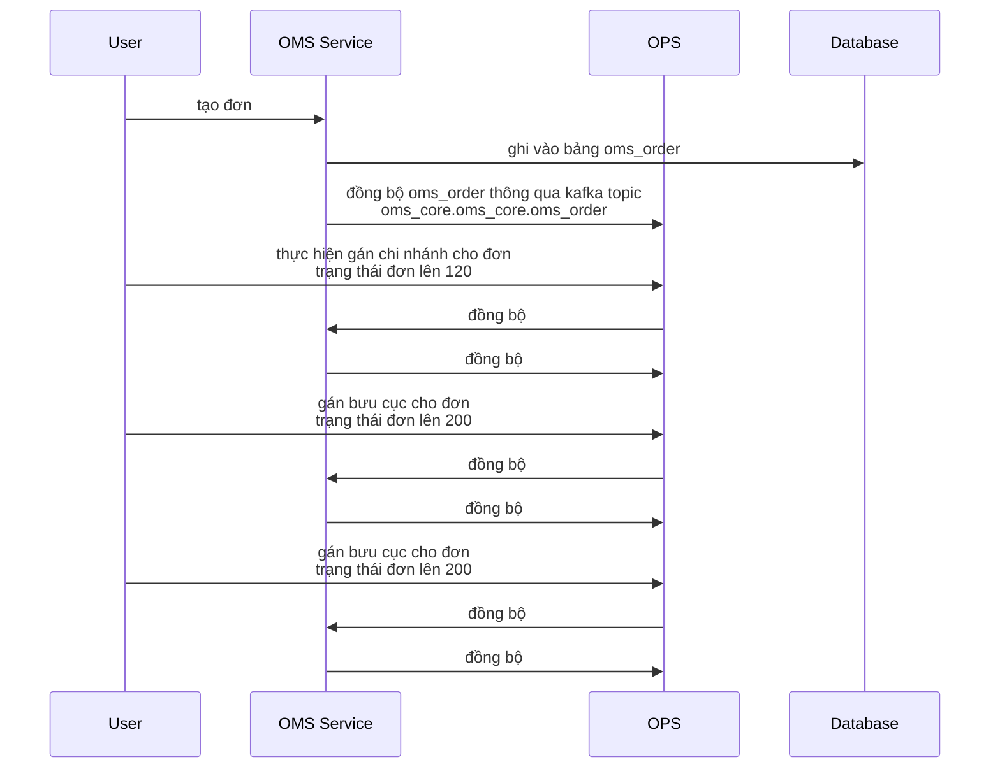
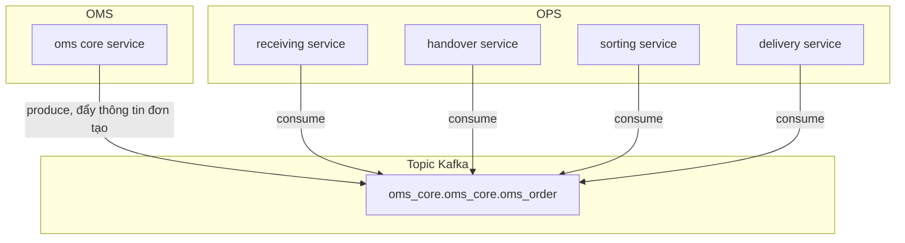

# I. Tổng quan hệ thống Global

# OMS Tạo đơn

# OPS Cập nhật đơn 
Note
- Trong hệ thống Global, thông tin đơn được oms quản lý, mọi sự thay đổi dữ liệu đều phải đi qua oms. Nếu oms tạo/cập nhật đơn, ops đồng bộ thông tin đơn qua topic kafka oms_core.oms_core.oms_order. Nếu thông tin đơn được thay đổi bởi 1 dịch vụ nào trong Ops, dịch vụ này sẽ đẩy event lên topic của nó, sau đó oms sẽ đồng bộ về rồi đẩy event lên topic oms_core.oms_core.oms_order và các service còn lại của Ops thực hiện đồng bộ.