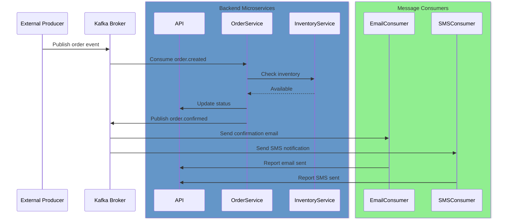

```mermaid
sequenceDiagram
    participant Producer as External Producer
    participant Kafka as Kafka Broker

    box rgb(100, 150, 200) Backend Microservices
        participant API
        participant OrderService
        participant InventoryService
    end

    box lightgreen Message Consumers
        participant EmailConsumer
        participant SMSConsumer
    end

    Producer->>Kafka: Publish order event
    Kafka->>OrderService: Consume order.created
    OrderService->>InventoryService: Check inventory
    InventoryService-->>OrderService: Available
    OrderService->>API: Update status

    OrderService->>Kafka: Publish order.confirmed
    Kafka->>EmailConsumer: Send confirmation email
    Kafka->>SMSConsumer: Send SMS notification

    EmailConsumer->>API: Report email sent
    SMSConsumer->>API: Report SMS sent
```